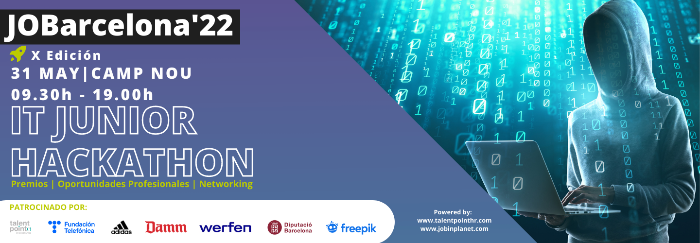

# JOBarcelona-22-Data-Science-Alejandro-Marcano-Van-Grieken



Este es uno de los retos clasificatorios que forman parte del hackathon online de JOBarcelona ’22. El resultado de este reto va a permitir a los ganadores asistir al hackathon presencial que se realizará el día 31 de mayo de 2022 en el Camp Nou.

## Enunciado del Reto


Los insectos nocturnos representan uno de los grupos más diversos de organismos, por lo que es de suma importancia estudiarlos.

Es por ello que un grupo de prestigiosos entomólogos han construido un ecosistema aislado con múltiples especies para poder estudiarlos en mayor detalle. Para este estudio están diseñando un sistema de sensores para poder trackear de forma automática las dinámicas y hábitos de estos insectos.

#### Overview: the dataset and challenge
Se emplearán dos datasets:

#### Training
El primero contiene datos de las mediciones de los sensores, el tiempo de las mediciones y el tipo de insecto identificado.

```
El dataset de clientes 'train.csv' contiene las siguientes variables:

* Hour: Hora a la que se ha hecho la medición.

* Minutes: Minutos en los que se ha realizado la medición.

* Sensor_alpha: Posición del insecto al sensor alpha.

* Sensor_beta: Posición del insecto al sensor beta.

* Sensor_gamma: Posición del insecto al sensor gamma.

* Sensor_alpha_plus: Posición del insecto al sensor alpha+.

* Sensor_beta_plus: Posición del insecto al sensor beta+.

* Sensor_gamma_plus: Posición del insecto al sensor gamma+.

* Insect: Categoría de insecto.

0 -> Lepidoptero
1 -> Himenoptera
2 -> Diptera
```

##### Testing
El dataset de clientes 'test_x.csv' contiene todas las variables excepto la variable target


### GOOGLE COLAB

Se edito el jupyter notebook en Google Colab para evitar la instalación de librerías en un archivo requirements.txt en un enviroment de python o anaconda o en un contenedor de docker. 

También se decidió usar .ipynb en vez de scripts .py ya que el formato .ipynb me permite añadir texto markdown y explicar de la mejor manera el código. 